# 第 7 章 使用语言：一个扩展的示例

> Seven. Using the Language: An Extended Example

The preceding three chapters introduced a pattern language for honing the fine detail of a model and maintaining a tight MODEL-DRIVEN DESIGN. In the earlier examples, the patterns were mostly applied one at a time, but on a real project you have to combine them. This chapter presents one elaborate example (still drastically simpler than a real project, of course). The example will step through a succession of model and design refinements as a hypothetical team deals with requirements and implementation issues and develops a MODEL-DRIVEN DESIGN, showing the forces that apply and how the patterns of Part II can resolve them.

> 前面三章介绍了一种模式语言，它可以对模型的细节进行精化，并可以严格遵守 MODEL-DRIVEN DESIGN。前面的示例基本上一次只应用一种模式，但在实际的项目中，必须将它们结合起来使用。本章介绍一个比较全面的示例（当然还是远远比实际项目简单）。这个示例将通过一个假想团队处理需求和实现问题，并开发出一个 MODEL-DRIVEN DESIGN，来一步步介绍模型和设计的精化过程，其间会展示所遇到的阻力，以及如何运用第二部分讨论的模式来解决它们。

## 7.1 INTRODUCING THE CARGO SHIPPING SYSTEM 货物运输系统简介

We’re developing new software for a cargo shipping company. The initial requirements are three basic functions.

> 假设我们正在为一家货运公司开发新软件。最初的需求包括 3 项基本功能：

1. Track key handling of customer cargo
2. Book cargo in advance
3. Send invoices to customers automatically when the cargo reaches some point in its handling

---

> 1. 跟踪客户货物的主要处理；
> 2. 事先预约货物；
> 3. 当货物到达其处理过程中的某个位置时，自动向客户寄送发票。

In a real project, it would take some time and iteration to get to the clarity of this model. Part III of this book will go into the discovery process in depth. But here we’ll start with a model that has the needed concepts in a reasonable form, and we’ll focus on fine-tuning the details to support design.

> 在实际的项目中，需要花费一些时间，并经过多次迭代才能得到清晰的模型。本书的第三部分将深入讨论这个发现过程。这里，我们先从一个已包含所需概念并且形式合理的模型开始，我们将通过调整模型的细节来支持设计。

<Figures figure="7-1">A class diagram representing a model of the shipping domain</Figures>
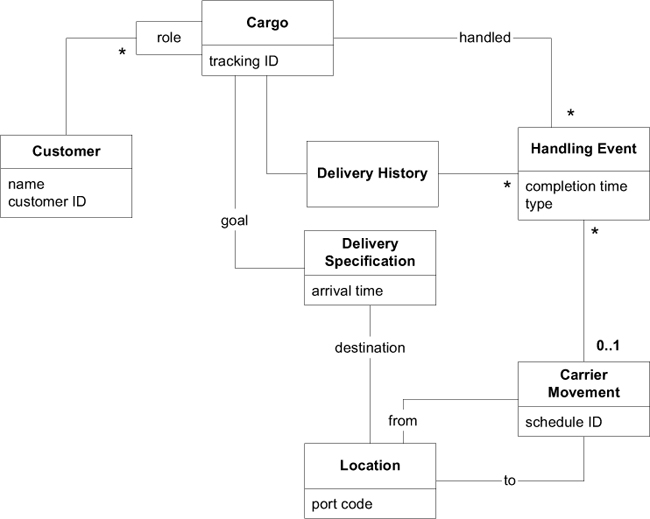

This model organizes domain knowledge and provides a language for the team. We can make statements like this:

> 这个模型将领域知识组织起来，并为团队提供了一种语言。我们可以做出像下面这样的陈述。

“Multiple Customers are involved with a Cargo, each playing a different role.”  
“The Cargo delivery goal is specified.”  
“A series of Carrier Movements satisfying the Specification will fulfill the delivery goal.”

---

> “一个 Cargo（货物）涉及多个 Customer（客户），每个 Customer 承担不同的角色。”  
> “Cargo 的运送目标已指定。”  
> “由一系列满足 Specification（规格）的 Carrier Movement（运输动作）来完成运送目标。”

Each object in the model has a clear meaning:

> 图 7-1 显示的模型中，每个对象都有明确的意义：

A Handling Event is a discrete action taken with the Cargo, such as loading it onto a ship or clearing it through customs. This class would probably be elaborated into a hierarchy of different kinds of incidents, such as loading, unloading, or being claimed by the receiver.

> Handling Event（处理事件）是对 Cargo 采取的不同操作，如将它装上船或清关。这个类可以被细化为一个由不同种类的事件（如装货、卸货或由收货人提货）构成的层次结构。

Delivery Specification defines a delivery goal, which at minimum would include a destination and an arrival date, but it can be more complex. This class follows the SPECIFICATION pattern (see Chapter 9).

> Delivery Specification（运送规格）定义了运送目标，这至少包括目的地和到达日期，但也可能更为复杂。这个类遵循规格模式（参见第 9 章）。

This responsibility could have been taken on by the Cargo object, but the abstraction of Delivery Specification gives at least three advantages.

> Delivery Specification 的职责本来可以由 Cargo 对象承担，但将 Delivery Specification 抽象出来至少有以下 3 个优点。

1. Without Delivery Specification, the Cargo object would be responsible for the detailed meaning of all those attributes and associations for specifying the delivery goal. This would clutter up Cargo and make it harder to understand or change.
2. This abstraction makes it easy and safe to suppress detail when explaining the model as a whole. For example, there could be other criteria encapsulated in the Delivery Specification, but a diagram at this level of detail would not have to expose it. The diagram is telling the reader that there is a SPECIFICATION of delivery, and the details of that are not important to think about (and, in fact, could be easily changed later).
3. This model is more expressive. Adding Delivery Specification says explicitly that the exact means of delivery of the Cargo is undetermined, but that it must accomplish the goal set out in the Delivery Specification.

---

> 1. 如果没有 Delivery Specification, Cargo 对象就需要负责提供用于指定运送目标的所有属性和关联。这会把 Cargo 对象搞乱，使它难以理解或修改。
> 2. 当将模型作为一个整体来解释时，这个抽象使我们能够轻松且安全地省略掉细节。例如，Delivery Specification 中可能还封装了其他标准，但就图 7-1 所要展示的细节而言，可以不必将其显示出来。这个图告诉读者存在运送规格，但其细节并非思考的重点（事实上，过后修改细节也很容易）。
> 3. 这个模型具有更强的表达力。Delivery Specification 清楚地表明：运送 Cargo 的具体方式没有明确规定，但它必须完成 Delivery Specification 中规定的目标。

A role distinguishes the different parts played by Customers in a shipment. One is the “shipper,” one the “receiver,” one the “payer,” and so on. Because only one Customer can play a given role for a particular Cargo, the association becomes a qualified many-to-one instead of many-to-many. Role might be implemented as simply a string, or it could be a class if other behavior is needed.

> Customer 在运输中所承担的部分是按照角色（role）来区分的，如 shipper（托运人）、receiver（收货人）、payer（付款人）等。由于一个 Cargo 只能由一个 Customer 来承担某个给定的角色，因此它们之间的关联是限定的多对一关系，而不是多对多。角色可以被简单地实现为字符串，当需要其他行为的时候，也可以将它实现为类。

Carrier Movement represents one particular trip by a particular Carrier (such as a truck or a ship) from one Location to another. Cargoes can ride from place to place by being loaded onto Carriers for the duration of one or more Carrier Movements.

> Carrier Movement 表示由某个 Carrier（如一辆卡车或一艘船）执行的从一个 Location（地点）到另一个 Location 的旅程。Cargo 被装上 Carrier 后，通过 Carrier 的一个或多个 Carrier Movement，就可以在不同地点之间转移。

Delivery History reflects what has actually happened to a Cargo, as opposed to the Delivery Specification, which describes goals. A Delivery History object can compute the current Location of the Cargo by analyzing the last load or unload and the destination of the corresponding Carrier Movement. A successful delivery would end with a Delivery History that satisfied the goals of the Delivery Specification.

> Delivery History（运送历史）反映了 Cargo 实际上发生了什么事情，它与 Delivery Specification 正好相对，后者描述了目标。Delivery History 对象可以通过分析最后一次装货和卸货以及对应的 Carrier Movement 的目的地来计算货物的当前位置。成功的运送将会得到一个满足 Delivery Specification 目标的 Delivery History。

All the concepts needed to work through the requirements just described are present in this model, assuming appropriate mechanisms to persist the objects, find the relevant objects, and so on. Such implementation issues are not dealt with in the model, but they must be in the design.

> 用于实现上述需求的所有概念都已包含在这个模型中，并假定已经有适当的机制来保存对象、查找相关对象等。这些实现问题不在模型中处理，但它们必须在设计中加以考虑。

In order to frame up a solid implementation, this model still needs some clarification and tightening.

> 为了建立一个健壮的实现，这个模型需要更清晰和严密一些。

Remember, ordinarily, model refinement, design, and implementation should go hand-in-hand in an iterative development process. But in this chapter, for clarity of explanation, we are starting with a relatively mature model, and changes will be motivated strictly by the need to connect that model with a practical implementation, employing the building block patterns.

> 记住，一般情况下，模型的精化、设计和实现应该在迭代开发过程中同步进行。但在本章中，为了使解释更加清楚，我们从一个相对成熟的模型开始，并严格限定修改的唯一动机是保证模型与具体实现相关联，在实现时采用构造块模式。

Ordinarily, as the model is being refined to support the design better, it should also be refined to reflect new insight into the domain. But in this chapter, for clarity of explanation, changes will be strictly motivated by the need to connect with a practical implementation, employing the building block patterns.

> 一般来说，当为了更好地支持设计而对模型进行精化时，也应该让模型反映出对领域的新理解。但在本章中，仍然是为了使解释更加清楚，严格限定修改的动机在于保证模型与具体实现相关联，在实现时采用构造块模式。

## 7.2 ISOLATING THE DOMAIN: INTRODUCING THE APPLICATIONS 隔离领域：引入应用层

To prevent domain responsibilities from being mixed with those of other parts of the system, let’s apply LAYERED ARCHITECTURE to mark off a domain layer.

> 为了防止领域的职责与系统的其他部分混杂在一起，我们应用 LAYERED ARCHITECTURE 把领域层划分出来。

Without going into deep analysis, we can identify three user-level application functions, which we can assign to three application layer classes.

> 无需深入分析，就可以识别出三个用户级别的应用程序功能，我们可以将这三个功能分配给三个应用层类。

1. A Tracking Query that can access past and present handling of a particular Cargo
2. A Booking Application that allows a new Cargo to be registered and prepares the system for it
3. An Incident Logging Application that can record each handling of the Cargo (providing the information that is found by the Tracking Query)

---

> 1. 第一个类是 Tracking Query（跟踪查询），它可以访问某个 Cargo 过去和现在的处理情况。
> 2. 第二个类是 Booking Application（预订应用），它允许注册一个新的 Cargo，并使系统准备好处理它。
> 3. 第三个类是 Incident Logging Application（事件日志应用），它记录对 Cargo 的每次处理（提供通过 Tracking Query 查找的信息）。

These application classes are coordinators. They should not work out the answers to the questions they ask. That is the domain layer’s job.

> 这些应用层类是协调者，它们只是负责提问，而不负责回答，回答是领域层的工作。

## 7.3 DISTINGUISHING ENTITIES AND VALUE OBJECTS 将 ENTITY 和 VALUE OBJECT 区别开

Considering each object in turn, we’ll look for identity that must be tracked or a basic value that is represented. First we’ll go through the clear-cut cases and then consider the more ambiguous ones.

> 依次考虑每个对象，看看这个对象是必须被跟踪的实体还是仅表示一个基本值。首先，我们来看一些比较明显的情况，然后考虑更含糊的情况。

Customer

Let’s start with an easy one. A Customer object represents a person or a company, an entity in the usual sense of the word. The Customer object clearly has identity that matters to the user, so it is an ENTITY in the model. How to track it? Tax ID might be appropriate in some cases, but an international company could not use that. This question calls for consultation with a domain expert. We discuss the problem with a businessperson in the shipping company, and we discover that the company already has a customer database in which each Customer is assigned an ID number at first sales contact. This ID is already used throughout the company; using the number in our software will establish continuity of identity between those systems. It will initially be a manual entry.

> 我们从一个简单的对象开始。Customer 对象表示一个人或一家公司，从一般意义上来讲它是一个实体。Customer 对象显然有对用户来说很重要的标识，因此它在模型中是一个 ENTITY。那么如何跟踪它呢？在某些情况下可以使用 Tax ID（纳税号），但如果是跨国公司就无法使用了。这个问题需要咨询领域专家。我们与运输公司的业务人员讨论这个问题，发现公司已经建立了客户数据库，其中每个 Customer 在第一次联系销售时被分配了一个 ID 号。这种 ID 已经在整个公司中使用，因此在我们的软件中使用这种 ID 号就可以与那些系统保持标识的连贯性。ID 号最初是手工录入的。

Cargo

Two identical crates must be distinguishable, so Cargo objects are ENTITIES. In practice, all shipping companies assign tracking IDs to each piece of cargo. This ID will be automatically generated, visible to the user, and in this case, probably conveyed to the customer at booking time.

> 两个完全相同的货箱必须要区分开，因此 Cargo 对象是 ENTITY。在实际情况中，所有运输公司会为每件货物分配一个跟踪 ID。这个 ID 是自动生成的、对用户可见，而且在本例中，在预订时可能还要发送给客户。

Handling Event and Carrier Movement

We care about such individual incidents because they allow us to keep track of what is going on. They reflect real-world events, which are not usually interchangeable, so they are ENTITIES. Each Carrier Movement will be identified by a code obtained from a shipping schedule.

> 我们关心这些独立事件是因为通过它们可以跟踪正在发生的事情。它们反映了真实世界的事件，而这些事件一般是不能互换的，因此它们是 ENTITY。每个 Carrier Movement 都将通过一个代码来识别，这个代码是从运输调度表得到的。

Another discussion with a domain expert reveals that Handling Events can be uniquely identified by the combination of Cargo ID, completion time, and type. For example, the same Cargo cannot be both loaded and unloaded at the same time.

> 在与领域专家的另一次讨论中，我们发现 Handling Event 有一种唯一的识别方法，那就是使用 Cargo ID、完成时间和类型的组合。例如，同一个 Cargo 不会在同一时间既装货又卸货。

Location

Two places with the same name are not the same. Latitude and longitude could provide a unique key, but probably not a very practical one, since those measurements are not of interest to most purposes of this system, and they would be fairly complicated. More likely, the Location will be part of a geographical model of some kind that will relate places according to shipping lanes and other domain-specific concerns. So an arbitrary, internal, automatically generated identifier will suffice.

> 名称相同的两个地点并不是同一个位置。经纬度可以作为唯一键，但这并不是一个非常可行的方案，因为系统的大部分功能并不关心经纬度是多少，而且经纬度的使用相当复杂。Location 更可能是某种地理模型的一部分，这个模型根据运输航线和其他特定于领域的关注点将地点关联起来。因此，使用自动生成的内部任意标识符就足够了。

Delivery History

This is a tricky one. Delivery Histories are not interchangeable, so they are ENTITIES. But a Delivery History has a one-to-one relationship with its Cargo, so it doesn’t really have an identity of its own. Its identity is borrowed from the Cargo that owns it. This will become clearer when we model the AGGREGATES.

> 这是一个比较复杂的对象。Delivery History 是不可互换的，因此它是 ENTITY。但 Delivery History 与 Cargo 是一对一关系，因此它实际上并没有自己的标识。它的标识来自于拥有它的 Cargo。当对 AGGREGATE 进行建模时这个问题会变得更清楚。

Delivery Specification

Although it represents the goal of a Cargo, this abstraction does not depend on Cargo. It really expresses a hypothetical state of some Delivery History. We hope that the Delivery History attached to our Cargo will eventually satisfy the Delivery Specification attached to our Cargo. If we had two Cargoes going to the same place, they could share the same Delivery Specification, but they could not share the same Delivery History, even though the histories start out the same (empty). Delivery Specifications are VALUE OBJECTS.

> 尽管它表示了 Cargo 的目标，但这种抽象并不依赖于 Cargo。它实际上表示某些 Delivery History 的假定状态。运送货物实际上就是让 Cargo 的 Delivery History 最后满足该 Cargo 的 Delivery Specification。如果有两个 Cargo 去往同一地点，那么它们可以用同一个 Delivery Specification，但它们不会共用同一个 Delivery History，尽管运送历史都是从同一个状态（空）开始。因此，Delivery Specification 是 VALUE OBJECT。

Role and Other Attributes

> Role 和其他属性

Role says something about the association it qualifies, but it has no history or continuity. It is a VALUE OBJECT, and it could be shared among different Cargo/Customer associations.

> Role 表示了有关它所限定的关联的一些信息，但它没有历史或连续性。因此它是一个 VALUE OBJECT，可以在不同的 Cargo/Customer 关联中共享它。

Other attributes such as time stamps or names are VALUE OBJECTS.

> 其他属性（如时间戳或名称）都是 VALUE OBJECT。

## 7.4 DESIGNING ASSOCIATIONS IN THE SHIPPING DOMAIN 设计运输领域中的关联

None of the associations in the original diagram specified a traversal direction, but bidirectional associations are problematic in a design. Also, traversal direction often captures insight into the domain, deepening the model itself.

> 图 7-1 中的所有关联都没有指定遍历方向，但双向关联在设计中容易产生问题。此外，遍历方向还常常反映出对领域的洞悉，使模型得以深化。

If the Customer has a direct reference to every Cargo it has shipped, it will become cumbersome for long-term, repeat Customers. Also, the concept of a Customer is not specific to Cargo. In a large system, the Customer may have roles to play with many objects. Best to keep it free of such specific responsibilities. If we need the ability to find Cargoes by Customer, this can be done through a database query. We’ll return to this issue later in this chapter, in the section on REPOSITORIES.

> 如果 Customer 对它所运送的每个 Cargo 都有直接引用，那么这对长期、频繁托运货物的客户将会非常不便。此外，Customer 这一概念并非只与 Cargo 相关。在大型系统中，Customer 可能具有多种角色，以便与许多对象交互，因此最好不要将它限定为这种具体的职责。如果需要按照 Customer 来查找 Cargo，那么可以通过数据库查询来完成。本章后面讨论 REPOSITORY 时还会回头讨论这个问题。

If our application were tracking the inventory of ships, traversal from Carrier Movement to Handling Event would be important. But our business needs to track only the Cargo. Making the association traversable only from Handling Event to Carrier Movement captures that understanding of our business. This also reduces the implementation to a simple object reference, because the direction with multiplicity was disallowed.

> 如果我们的应用程序要对一系列货船进行跟踪，那么从 Carrier Movement 遍历到 Handling Event 将是很重要的。但我们的业务只需跟踪 Cargo，因此只需从 Handling Event 遍历到 Carrier Movement 就能满足我们的业务需求。由于舍弃了具有多重性的遍历方向，实现简化为简单的对象引用。

The rationale behind the remaining decisions is explained in Figure 7.2, on the next page.

> 图 7-2 解释了其他设计决策背后的原因。

<Figures figure="7-2">Traversal direction has been constrained on some associations.</Figures>
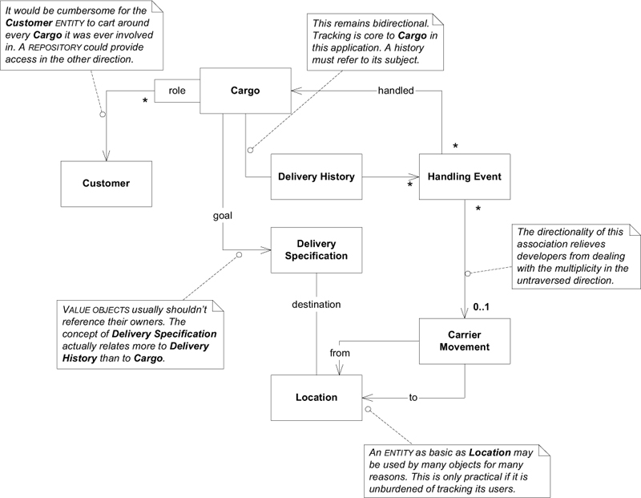

There is one circular reference in our model: Cargo knows its Delivery History, which holds a series of Handling Events, which in turn point back to the Cargo. Circular references logically exist in many domains and are sometimes necessary in design as well, but they are tricky to maintain. Implementation choices can help by avoiding holding the same information in two places that must be kept synchronized. In this case, we can make a simple but fragile implementation (in Java) in an initial prototype, by giving Delivery History a List object containing Handling Events. But at some point we’ll probably want to drop the collection in favor of a database lookup with Cargo as the key. This discussion will be taken up again when choosing REPOSITORIES. If the query to see the history is relatively infrequent, this should give good performance, simplify maintenance, and reduce the overhead of adding Handling Events. If this query is very frequent, then it is better to go ahead and maintain the direct pointer. These design trade-offs balance simplicity of implementation against performance. The model is the same; it contains the cycle and the bidirectional association.

> 模型中存在一个循环引用：Cargo 知道它的 Delivery History, Delivery History 中保存了一系列的 Handling Event，而 Handling Event 又反过来指向 Cargo。很多领域在逻辑上都存在循环引用，而且循环引用在设计中有时是必要的，但它们维护起来很复杂。在选择实现时，应该避免把必须同步的信息保存在两个不同的地方，这样对我们的工作很有帮助。对于这个例子，我们可以在初期原型中使用一个简单但不太健壮的实现（用 Java 语言）——在 Delivery History 中提供一个 List 对象，并把 Handling Event 都放到这个 List 对象中。但在某些时候，我们可能不想使用集合，以便能够用 Cargo 作为键来执行数据库查询。在选择存储库时，我们还会讨论到这一点。如果查询历史的操作相对来说不是很多，那么这种方法可以提供很好的性能、简化维护并减少添加 Handling Event 的开销。如果这种查询很频繁，那么最好还是直接引用。这种设计上的折中其实就是在实现的简单性和性能之间达成一个平衡。模型还是同一个模型，它包含了循环关联和双向关联。

## 7.5 AGGREGATE BOUNDARIES AGGREGATE 边界

Customer, Location, and Carrier Movement have their own identities and are shared by many Cargoes, so they must be the roots of their own AGGREGATES, which contain their attributes and possibly other objects below the level of detail of this discussion. Cargo is also an obvious AGGREGATE root, but where to draw the boundary takes some thought.

> Customer、Location 和 Carrier Movement 都有自己的标识，而且被许多 Cargo 共享，因此，它们在各自的 AGGREGATE 中必须是根，这些聚合除了包含各自的属性之外，可能还包含其他比这里讨论的细节级别更低层的对象。Cargo 也是一个明显的 AGGREGATE 根，但把它的边界画在哪里还需要仔细思考一下。

The Cargo AGGREGATE could sweep in everything that would not exist but for the particular Cargo, which would include the Delivery History, the Delivery Specification, and the Handling Events. This fits for Delivery History. No one would look up a Delivery History directly without wanting the Cargo itself. With no need for direct global access, and with an identity that is really just derived from the Cargo, the Delivery History fits nicely inside Cargo’s boundary, and it does not need to be a root. The Delivery Specification is a VALUE OBJECT, so there are no complications from including it in the Cargo AGGREGATE.

> 如图 7-3 所示，Cargo AGGREGATE 可以把一切因 Cargo 而存在的事物包含进来，这当中包括 Delivery History、Delivery Specification 和 Handling Event。这很适合 Delivery History，因为没人会在不知道 Cargo 的情况下直接去查询 Delivery History。因为 Delivery History 不需要直接的全局访问，而且它的标识实际上只是由 Cargo 派生出的，因此很适合将 Delivery History 放在 Cargo 的边界之内，并且它也无需是一个 AGGREGATE 根。Delivery Specification 是一个 VALUE OBJECT，因此将它包含在 Cargo AGGREGATE 中也不复杂。

The Handling Event is another matter. Previously we have considered two possible database queries that would search for these: one, to find the Handling Events for a Delivery History as a possible alternative to the collection, would be local within the Cargo AGGREGATE; the other would be used to find all the operations to load and prepare for a particular Carrier Movement. In the second case, it seems that the activity of handling the Cargo has some meaning even when considered apart from the Cargo itself. So the Handling Event should be the root of its own AGGREGATE.

> Handling Event 就是另外一回事了。前面已经考虑了两种与其有关的数据库查询，一种是当不想使用集合时，用查找某个 Delivery History 的 Handling Event 作为一种可行的替代方法，这种查询是位于 Cargo AGGREGATE 内部的本地查询；另一种查询是查找装货和准备某次 Carrier Movement 时所进行的所有操作。在第二种情况中，处理 Cargo 的活动看起来是有意义的（即使是与 Cargo 本身分开来考虑时也是如此），因此 Handling Event 应该是它自己的 AGGREGATE 的根。

<Figures figure="7-3">AGGREGATE boundaries imposed on the model. (Note: An ENTITY outside a drawn boundary is implied to be the root of its own AGGREGATE.)</Figures>
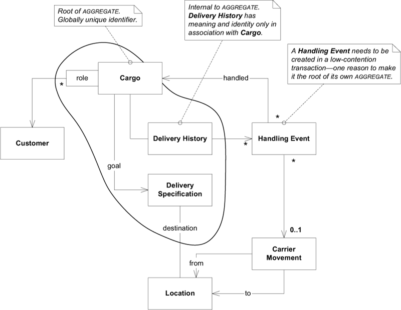

## 7.6 SELECTING REPOSITORIES 选择 REPOSITORY

There are five ENTITIES in the design that are roots of AGGREGATES, so we can limit our consideration to these, since none of the other objects is allowed to have REPOSITORIES.

> 在我们的设计中，有 5 个 ENTITY 是 AGGREGATE 的根，因此在选择存储库时只需考虑这 5 个实体，因为其他对象都不能有 REPOSITORY。

To decide which of these candidates should actually have a REPOSITORY, we must go back to the application requirements. In order to take a booking through the Booking Application, the user needs to select the Customer(s) playing the various roles (shipper, receiver, and so on). So we need a Customer Repository. We also need to find a Location to specify as the destination for the Cargo, so we create a Location Repository.

> 为了确定这 5 个实体当中哪些确实需要 REPOSITORY，必须回头看一下应用程序的需求。要想通过 Booking Application 进行预订，用户需要选择承担不同角色（托运人、收货人等）的 Customer。因此需要一个 Customer Repository。在指定货物的目的地时还需要一个 Location，因此还需要创建一个 Location Repository。

The Activity Logging Application needs to allow the user to look up the Carrier Movement that a Cargo is being loaded onto, so we need a Carrier Movement Repository. This user must also tell the system which Cargo has been loaded, so we need a Cargo Repository.

> 用户需要通过 Activity Logging Application 来查找装货的 Carrier Movement，因此需要一个 Carrier Movement Repository。用户还必须告诉系统哪个 Cargo 已经完成了装货，因此还需要一个 Cargo Repository，如图 7-4 所示。

<Figures figure="7-4">REPOSITORIES give access to selected AGGREGATE roots.</Figures>
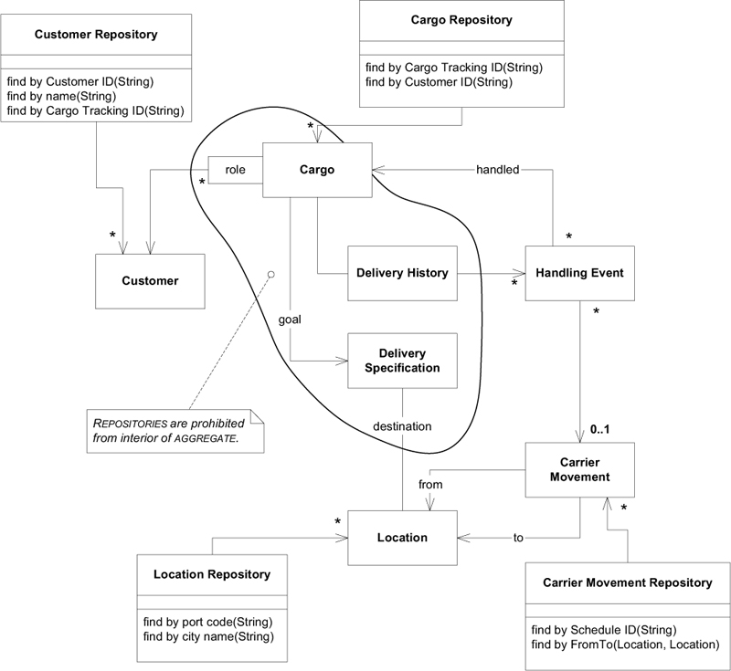

For now there is no Handling Event Repository, because we decided to implement the association with Delivery History as a collection in the first iteration, and we have no application requirement to find out what has been loaded onto a Carrier Movement. Either of these reasons could change; if they did, then we would add a REPOSITORY.

> 我们没有创建 Handling Event Repository，因为我们决定在第一次迭代中将它与 Delivery History 的关联实现为一个集合，而且应用程序并不需要查找在一次 Carrier Movement 中都装载了什么货物。这两个原因都有可能发生变化，如果确实改变了，可以增加一个 REPOSITORY。

## 7.7 WALKING THROUGH SCENARIOS 场景走查

To cross-check all these decisions, we have to constantly step through scenarios to confirm that we can solve application problems effectively.

> 为了复核这些决策，我们需要经常走查场景，以确保能够有效地解决应用问题。

### 7.7.1 Sample Application Feature: Changing the Destination of a Cargo 应用程序特性举例：更改 Cargo 的目的地

Occasionally a Customer calls up and says, “Oh no! We said to send our cargo to Hackensack, but we really need it in Hoboken.” We are here to serve, so the system is required to provide for this change.

> 有时 Customer 会打电话说：“糟了！我们原来说把货物运到 Hackensack，但实际上应该运往 Hoboken。”既然我们提供运输服务，就一定要让系统能够进行这样的修改。

Delivery Specification is a VALUE OBJECT, so it would be simplest to just to throw it away and get a new one, then use a setter method on Cargo to replace the old one with the new one.

> Delivery Specification 是一个 VALUE OBJECT，因此最简单的方法是抛弃它，再创建一个新的，然后使用 Cargo 上的 setter 方法把旧值替换成新值。

### 7.7.2 Sample Application Feature: Repeat Business 应用程序特性举例：重复业务

The users say that repeated bookings from the same Customers tend to be similar, so they want to use old Cargoes as prototypes for new ones. The application will allow them to find a Cargo in the REPOSITORY and then select a command to create a new Cargo based on the selected one. We’ll design this using the PROTOTYPE pattern (Gamma et al. 1995).

> 用户指出，相同 Customer 的重复预订往往是类似的，因此他们想要将旧 Cargo 作为新 Cargo 的原型。应用程序应该允许用户在存储库中查找一个 Cargo，然后选择一条命令来基于选中的 Cargo 创建一个新 Cargo。我们将利用 PROTOTYPE 模式[Gamma et al. 1995]来设计这一功能。

Cargo is an ENTITY and is the root of an AGGREGATE. Therefore, it must be copied carefully; we need to consider what should happen to each object or attribute enclosed by its AGGREGATE boundary. Let’s go over each one:

> Cargo 是一个 ENTITY，而且是 AGGREGATE 的根。因此在复制它时要非常小心，其 AGGREGATE 边界内的每个对象或属性的处理都需要仔细考虑，下面逐个来看一下。

- Delivery History: We should create a new, empty one, because the history of the old one doesn’t apply. This is the usual case with ENTITIES inside the AGGREGATE boundary.
- Customer Roles: We should copy the Map (or other collection) that holds the keyed references to Customers, including the keys, because they are likely to play the same roles in the new shipment. But we have to be careful not to copy the Customer objects themselves. We must end up with references to the same Customer objects as the old Cargo object referenced, because they are ENTITIES outside the AGGREGATE boundary.
- Tracking ID: We must provide a new Tracking ID from the same source as we would when creating a new Cargo from scratch.

---

> - Delivery History：应创建一个新的、空的 Delivery History，因为原有 Delivery History 的历史并不适用。这是 AGGREGATE 内部的实体的常见情况。
> - Customer Roles：应该复制存有 Customer 引用的 Map（或其他集合）——这些引用通过键来标识，键也要一起复制，这些 Customer 在新的运输业务中可能担负相同的角色。但必须注意不要复制 Customer 对象本身。在复制之后，应该保证和原来的 Cargo 引用相同的 Customer 对象，因为它们是 AGGREGATE 边界之外的 ENTITY。
> - Tracking ID：我们必须提供一个新的 Tracking ID，它应该来自创建新 Cargo 时的同一个来源。

Notice that we have copied everything inside the Cargo AGGREGATE boundary, we have made some modifications to the copy, but we have affected nothing outside the AGGREGATE boundary at all.

> 注意，我们复制了 Cargo AGGREGATE 边界内部的所有对象，并对副本进行了一些修改，但这并没有对 AGGREGATE 边界之外的对象产生任何影响。

## 7.8 OBJECT CREATION 对象的创建

## 7.8.1 FACTORIES and Constructors for Cargo Cargo 的 FACTORY 和构造函数

Even if we have a fancy FACTORY for Cargo, or use another Cargo as the FACTORY, as in the “Repeat Business” scenario, we still have to have a primitive constructor. We would like the constructor to produce an object that fulfills its invariants or at least, in the case of an ENTITY, has its identity intact.

> 即使为 Cargo 创建了复杂而精致的 FACTORY，或像“重复业务”一节那样使用另一个 Cargo 作为 FACTORY，我们仍然需要有一个基本的构造函数。我们希望用构造函数来生成一个满足固定规则的对象，或者，就 ENTITY 而言，至少保持其标识不变。

Given these decisions, we might create a FACTORY method on Cargo such as this:

> 考虑到这些因素，我们可以在 Cargo 上创建一个 FACTORY 方法，如下所示：

```java
public Cargo copyPrototype(String newTrackingID)
```

Or we might make a method on a standalone FACTORY such as this:

> 或者可以为一个独立的 FACTORY 添加以下方法：

```java
public Cargo newCargo(Cargo prototype, String newTrackingID)
```

A standalone FACTORY could also encapsulate the process of obtaining a new (automatically generated) ID for a new Cargo, in which case it would need only one argument:

> 独立 FACTORY 还可以把为新 Cargo 获取新（自动生成的）ID 的过程封装起来，这样它就只需要一个参数：

```java
public Cargo newCargo(Cargo prototype)
```

The result returned from any of these FACTORIES would be the same: a Cargo with an empty Delivery History, and a null Delivery Specification.

> 这些 FACTORY 返回的结果是完全相同的，都是一个 Cargo，其 Delivery History 为空，且 Delivery Specification 为 null。

The two-way association between Cargo and Delivery History means that neither Cargo nor Delivery History is complete without pointing to its counterpart, so they must be created together. Remember that Cargo is the root of the AGGREGATE that includes Delivery History. Therefore, we can allow Cargo’s constructor or FACTORY to create a Delivery History. The Delivery History constructor will take a Cargo as an argument. The result would be something like this:

> Cargo 与 Delivery History 之间的双向关联意味着它们必须要互相指向对方才算是完整的，因此它们必须被一起创建出来。记住，Cargo 是 AGGREGATE 的根，而这个 AGGREGATE 包含 Delivery History。因此，我们可以用 Cargo 的构造函数或 FACTORY 来创建 Delivery History。Delivery History 的构造函数将 Cargo 作为参数。这样就可以编写以下代码：

```java
public Cargo(String id) {
    trackingID = id;
    deliveryHistory = new DeliveryHistory(this);
    customerRoles = new HashMap();
}
```

The result is a new Cargo with a new Delivery History that points back to the Cargo. The Delivery History constructor is used exclusively by its AGGREGATE root, namely Cargo, so that the composition of Cargo is encapsulated.

> 结果得到一个新的 Cargo，它带有一个指向它自己的新的 Delivery History。由于 Delivery History 的构造函数只供其 AGGREGATE 根（即 Cargo）使用，这样 Cargo 的组成就被封装起来了。

### 7.8.2 Adding a Handling Event 添加 Handling Event

Each time the cargo is handled in the real world, some user will enter a Handling Event using the Incident Logging Application.

> 货物在真实世界中的每次处理，都会有人使用 Incident Logging Application 来输入一条 Handling Event 记录。

Every class must have primitive constructors. Because the Handling Event is an ENTITY, all attributes that define its identity must be passed to the constructor. As discussed previously, the Handling Event is uniquely identified by the combination of the ID of its Cargo, the completion time, and the event type. The only other attribute of Handling Event is the association to a Carrier Movement, which some types of Handling Events don’t even have. A basic constructor that creates a valid Handling Event would be:

> 每个类都必须有一个基本的构造函数。由于 Handling Event 是一个 ENTITY，所以必须把定义了其标识的所有属性传递给构造函数。如前所述，Handling Event 是通过 Cargo 的 ID、完成时间和事件类型的组合来唯一标识的。Handling Event 唯一剩下的属性是与 Carrier Movement 的关联，而有些类型的 Handling Event 甚至没有这个属性。综上，创建一个有效的 Handling Event 的基本构造函数是：

```java
public HandlingEvent(Cargo c, String eventType, Date timeStamp) {
    handled = c;
    type = eventType;
    completionTime = timeStamp;
}
```

Nonidentifying attributes of an ENTITY can usually be added later. In this case, all attributes of the Handling Event are going to be set in the initial transaction and never altered (except possibly for correcting a data-entry error), so it could be convenient, and make client code more expressive, to add a simple FACTORY METHOD to Handling Event for each event type, taking all the necessary arguments. For example, a “loading event” does involve a Carrier Movement:

> 就 ENTITY 而言，那些非标识作用的属性通常可以过后再添加。在本例中，Handling Event 的所有属性都是在初始事务中设置的，而且过后不再改变（纠正数据录入错误除外），因此针对每种事件类型，为 Handling Event 添加一个简单的 FACTORY METHOD（并带有所有必要的参数）是很方便的做法，这还使得客户代码具有更强的表达力。例如，loading event（装货事件）确实涉及一个 Carrier Movement。

```java
public static HandlingEvent newLoading(
   Cargo c, CarrierMovement loadedOnto, Date timeStamp) {
      HandlingEvent result =
         new HandlingEvent(c, LOADING_EVENT, timeStamp);
      result.setCarrierMovement(loadedOnto);
      return result;
}
```

The Handling Event in the model is an abstraction that might encapsulate a variety of specialized Handling Event classes, ranging from loading and unloading to sealing, storing, and other activities not related to Carriers. They might be implemented as multiple subclasses or have complicated initialization—or both. By adding FACTORY METHODS to the base class (Handling Event) for each type, instance creation is abstracted, freeing the client from knowledge of the implementation. The FACTORY is responsible for knowing what class was to be instantiated and how it should be initialized.

> 模型中的 Handling Event 是一个抽象，它可以把各种具体的 Handling Event 类封装起来，包括装货、卸货、密封、存放以及其他与 Carrier 无关的活动。它们可以被实现为多个子类，或者通过复杂的初始化过程来实现，也可以将这两种方法结合起来使用。通过在基类（Handling Event）中为每个类型添加 FACTORY METHOD，可以将实例创建的工作抽象出来，这样客户就不必了解实现的知识。FACTORY 会知道哪个类需要被实例化，以及应该如何对它初始化。

Unfortunately, the story isn’t quite that simple. The cycle of references, from Cargo to Delivery History to History Event and back to Cargo, complicates instance creation. The Delivery History holds a collection of Handling Events relevant to its Cargo, and the new object must be added to this collection as part of the transaction. If this back-pointer were not created, the objects would be inconsistent.

> 遗憾的是，事情并不是这么简单。Cargo→Delivery History→History Event→Cargo 这个引用循环使实例创建变得很复杂。Delivery History 保存了与其 Cargo 有关的 Handling Event 集合，而且新对象必须作为事务的一部分来添加到这个集合中（见图 7-5）。如果没有创建这个反向指针，那么对象间将发生不一致。

<Figures figure="7-5">Adding a Handling Event requires inserting it into a Delivery History.</Figures>
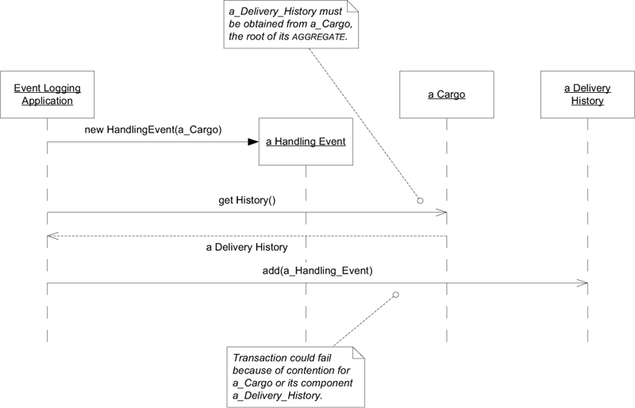

Creation of the back-pointer could be encapsulated in the FACTORY (and kept in the domain layer where it belongs), but now we’ll look at an alternative design that eliminates this awkward interaction altogether.

> 我们可以把反向指针的创建封装到 FACTORY 中（并将其放在领域层中——它属于领域层），但现在我们来看另一种设计，它完全消除了这种别扭的交互。

## 7.9 PAUSE FOR REFACTORING: AN ALTERNATIVE DESIGN OF THE CARGO AGGREGATE 停一下，重构：Cargo AGGREGATE 的另一种设计

Modeling and design is not a constant forward process. It will grind to a halt unless there is frequent refactoring to take advantage of new insights to improve the model and the design.

> 建模和设计并不总是一个不断向前的过程，如果不经常进行重构，以便利用新的知识来改进模型和设计，那么建模和设计将会停滞不前。

By now, there are a couple of cumbersome aspects to this design, although it does work and it does reflect the model. Problems that didn’t seem important when starting the design are beginning to be annoying. Let’s go back to one of them and, with the benefit of hindsight, stack the design deck in our favor.

> 到目前为止，我们的设计中有几个蹩脚的地方，虽然这并不影响设计发挥作用，而且设计也确实反映了模型。但设计之初看上去不太重要的问题正渐渐变得棘手。让我们借助事后的认识来解决其中一个问题，以便为以后的设计做好铺垫。

The need to update Delivery History when adding a Handling Event gets the Cargo AGGREGATE involved in the transaction. If some other user was modifying Cargo at the same time, the Handling Event transaction could fail or be delayed. Entering a Handling Event is an operational activity that needs to be quick and simple, so an important application requirement is the ability to enter Handling Events without contention. This pushes us to consider a different design.

> 由于添加 Handling Event 时需要更新 Delivery History，而更新 Delivery History 会在事务中牵涉 Cargo AGGREGATE。因此，如果同一时间其他用户正在修改 Cargo，那么 Handling Event 事务将会失败或延迟。输入 Handling Event 是需要迅速完成的简单操作，因此能够在不发生争用的情况下输入 Handling Event 是一项重要的应用程序需求。这促使我们考虑另一种不同的设计。

Replacing the Delivery History’s collection of Handling Events with a query would allow Handling Events to be added without raising any integrity issues outside its own AGGREGATE. This change would enable such transactions to complete without interference. If there are a lot of Handling Events being entered and relatively few queries, this design is more efficient. In fact, if a relational database is the underlying technology, a query was probably being used under the covers anyway to emulate the collection. Using a query rather than a collection would also reduce the difficulty of maintaining consistency in the cyclical reference between Cargo and Handling Event.

> 我们在 Delivery History 中可以不使用 Handling Event 的集合，而是用一个查询来代替它，这样在添加 Handling Event 时就不会在其自己的 AGGREGATE 之外引起任何完整性问题。如此修改之后，这些事务就不再受到干扰。如果有很多 Handling Event 同时被录入，而相对只有很少的查询，那么这种设计更加高效。实际上，如果使用关系数据库作为底层技术，那么我们可以设法在底层使用查询来模拟集合。使用查询来代替集合还可以减小维护 Cargo 和 Handling Event 之间循环引用一致性的难度。

To take responsibility for the queries, we’ll add a REPOSITORY for Handling Events. The Handling Event Repository will support a query for the Events related to a certain Cargo. In addition, the REPOSITORY can provide queries optimized to answer specific questions efficiently. For example, if a frequent access path is the Delivery History finding the last reported load or unload, in order to infer the current status of the Cargo, a query could be devised to return just that relevant Handling Event. And if we wanted a query to find all Cargoes loaded on a particular Carrier Movement, we could easily add it.

> 为了使用查询，我们为 Handling Event 增加一个 REPOSITORY。Handling Event Repository 将用来查询与特定 Cargo 有关的 Event。此外，REPOSITORY 还可以提供优化的查询，以便更高效地回答特定的问题。例如，为了推断 Cargo 的当前状态，常常需要在 Delivery History 中查找最后一次报告的装货或卸货操作，如果这个查找操作被频繁地使用，那么就可以设计一个查询直接返回相关的 Handling Event。而且，如果需要通过查询找到某次 Carrier Movement 装载的所有 Cargo，那么很容易就可以增加这个查询。

<Figures figure="7-6">Implementing Delivery History’s collection of Handling Events as a query makes insertion of Handling Events simple and free of contention with the Cargo AGGREGATE.</Figures>
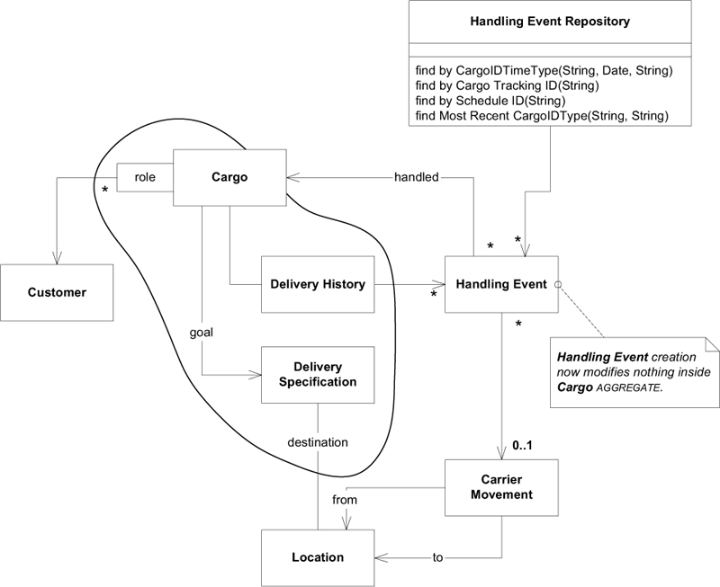

This leaves the Delivery History with no persistent state. At this point, there is no real need to keep it around. We could derive Delivery History itself whenever it is needed to answer some question. We can derive this object because, although the ENTITY will be repeatedly recreated, the association with the same Cargo object maintains the thread of continuity between incarnations.

> 这样一来，Delivery History 就不再有持久状态了，因此实际上无需再保留它。无论何时需要用 Delivery History 回答某个问题时，都可以将其生成出来。我们之所以可以生成这个对象——尽管在不断地重建这个 Entity，是因为这些对象关联了相同的 Cargo 对象，而这个 Cargo 对象在 Delivery History 的各个化身间维护了连续性。

The circular reference is no longer tricky to create and maintain. The Cargo Factory will be simplified to no longer attach an empty Delivery History to new instances. Database space can be reduced slightly, and the actual number of persistent objects might be reduced considerably, which is a limited resource in some object databases. If the common usage pattern is that the user seldom queries for the status of a Cargo until it arrives, then a lot of unneeded work will be avoided altogether.

> 循环引用的创建和维护也不再是问题。Cargo Factory 将被简化，不再需要为新的 Cargo 实例创建一个空的 Delivery History。数据库空间会略微减少，而且持久化对象的实际数量可能减少很多（在某些对象数据库中，能容纳的持久化对象的数量是有限的）。如果常见的使用模式是：用户在货物到达之前很少查询它的状态，那么这种设计可以避免很多不必要的工作。

On the other hand, if we are using an object database, traversing an association or an explicit collection is probably much faster than a REPOSITORY query. If the access pattern includes frequent listing of the full history, rather than the occasional targeted query of last position, the performance trade-off might favor the explicit collection. And remember that the added feature (“What is on this Carrier Movement?”) hasn’t been requested yet, and may never be, so we don’t want to pay much for that option.

> 另一方面，如果我们正在使用对象数据库，则通过遍历关联或显式的集合来查找对象可能会比通过 REPOSITORY 查询快得多。如果用户在使用系统时需要频繁地列出货物处理的全部历史，而不是偶尔查询最后一次处理，那么出于性能上的考虑，使用显式的集合比较有利。此外要记住，现在并不需要查询“这次 Carrier Movement 上都装载了什么”，而且这个要求可能永远也不会被提出来，因此暂时不必过多地注意该选项。

These kinds of alternatives and design trade-offs are everywhere, and I could come up with lots of examples just in this little simplified system. But the important point is that these are degrees of freedom within the same model. By modeling VALUES, ENTITIES, and their AGGREGATES as we have, we have reduced the impact of such design changes. For example, in this case all changes are encapsulated within the Cargo’s AGGREGATE boundary. It also required the addition of the Handling Event Repository, but it did not call for any redesign of the Handling Event itself (although some implementation changes might be involved, depending on the details of the REPOSITORY framework).

> 这些类型的修改和设计折中随处可见，仅仅在这个简化的小系统中，我就可以举出许多示例。但重要的一点是，这些修改和折中仅限于同一个模型内部。通过对 VALUE、ENTITY 以及它们的 AGGREGATE 进行建模（正如我们已经做的那样），已经大大减小了这些设计修改的影响。例如，在这个示例中，所有的修改都被封装在 Cargo 的 AGGREGATE 边界之内。它还需要增加一个 Handling Event Repository，但并不需要重新设计 Handling Event 本身（虽然根据不同的 REPOSITORY 框架细节，可能需要对实现进行一些修改）。

## 7.10 MODULES IN THE SHIPPING MODEL 运输模型中的 MODULE

So far we’ve been looking at so few objects that modularity is not an issue. Now let’s look at a little bigger part of a shipping model (though still simplified, of course) to see its organization into MODULES that will affect the model.

> 到目前为止，我们只看到了很少的几个对象，因此 MODULE 化还不是问题。现在，我们来看看大一点的运输模型（当然，这仍然是简化的），从而了解一下 MODULE 的组织怎样影响模型。

Figure 7.7 shows a model neatly partitioned by a hypothetical enthusiastic reader of this book. This diagram is a variation on the infrastructure-driven packaging problem raised in Chapter 5. In this case, the objects have been grouped according to the pattern each follows. The result is that objects that conceptually have little relationship (low cohesion) are crammed together, and associations run willy-nilly between all the MODULES (high coupling). The packages tell a story, but it is not the story of shipping; it is the story of what the developer was reading at the time.

> 图 7-7 展示了一个划分整齐的模型，这里假设该模型是由本书的一位热心读者划分的。这个图是第 5 章中所提及的由基础设施驱动的打包问题的一个变形。在本例中，对象是根据其所遵循的模式来分组的。结果那些在概念上几乎没有关系（低内聚）的对象被分到了一起，而且所有 MODULE 之间的关联错综复杂（高耦合）。这种打包方式也描述了一件事情，但描述的不是运输，而是开发人员在那个时候对模型的认识。

<Figures figure="7-7">These MODULES do not convey domain knowledge.</Figures>
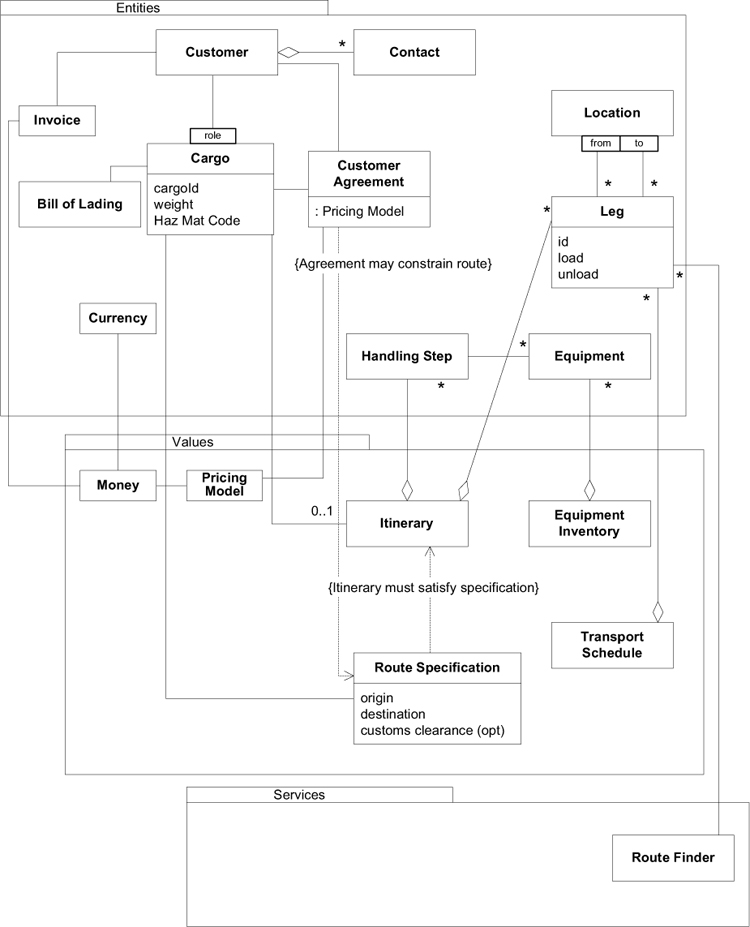

Partitioning by pattern may seem like an obvious error, but it is not really any less sensible than separating persistent objects from transient ones or any other methodical scheme that is not grounded in the meaning of the objects.

> 按模式划分看起来是一个明显的错误，但按照对象是持久对象还是临时对象来划分，或者使用任何其他划分方法，而不是根据对象的意义来划分，也同样不靠谱。

Instead, we should be looking for the cohesive concepts and focusing on what we want to communicate to others on the project. As with smaller scale modeling decisions, there are many ways to do it. Figure 7.8 shows a straightforward one.

> 相反，我们应该寻找紧密关联的概念，并弄清楚我们打算向项目中的其他人员传递什么信息。如同应对规模较小的建模决策时，总是会有多种方法可以达成目的。图 7-8 显示了一种直观的划分方法。

<Figures figure="7-8">MODULES based on broad domain concepts</Figures>
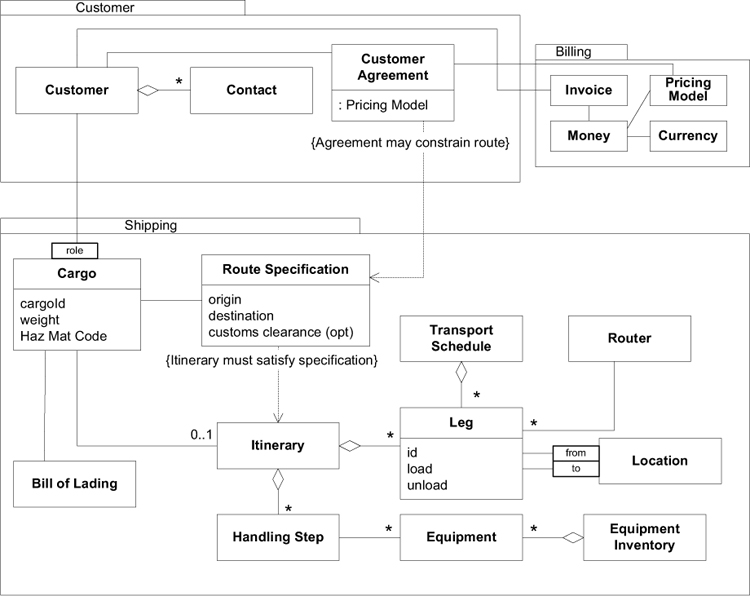

The MODULE names in Figure 7.8 contribute to the team’s language. Our company does shipping for customers so that we can bill them. Our sales and marketing people deal with customers, and make agreements with them. The operations people do the shipping, getting the cargo to its specified destination. The back office takes care of billing, submitting invoices according to the pricing in the customer’s agreement. That’s one story I can tell with this set of MODULES.

> 图 7-8 中的 MODULE 名称成为团队语言的一部分。我们的公司为客户（Customer）运输货物（Shipping），因此向他们收取费用（Bill），公司的销售和营销人员与 Customer 磋商并签署协议，操作人员负责将货物 Shipping 到指定目的地，后勤办公人员负责 Billing（处理账单），并根据 Customer 协议开具发票。这就是可以通过这组 MODULE 描述的业务。

This intuitive breakdown could be refined, certainly, in successive iterations, or even replaced entirely, but it is now aiding MODEL-DRIVEN DESIGN and contributing to the UBIQUITOUS LANGUAGE.

> 当然，这种直观的分解可以通过后续迭代来完善，甚至可以被完全取代，但它现在对 MODEL-DRIVEN DESIGN 大有帮助，并且使 UBIQUITOUS LANGUAGE 更加丰富。

## 7.11 INTRODUCING A NEW FEATURE: ALLOCATION CHECKING 引入新特性：配额检查

Up to this point, we’ve been working off the initial requirements and model. Now the first major new functions are going to be added.

> 到目前为止，我们已经实现了最初的需求和模型。现在要添加第一批重要的新功能。

The sales division of the imaginary shipping company uses other software to manage client relationships, sales projections, and so forth. One feature supports yield management by allowing the firm to allocate how much cargo of specific types they will attempt to book based on the type of goods, the origin and destination, or any other factor they may choose that can be entered as a category name. These constitute goals of how much will be sold of each type, so that more profitable types of business will not be crowded out by less profitable cargoes, while at the same time avoiding underbooking (not fully utilizing their shipping capacity) or excessive overbooking (resulting in bumping cargo so often that it hurts customer relationships).

> 在这个假想的运输公司中，销售部门使用其他软件来管理客户关系、销售计划等。其中有一项功能是效益管理（yield management），利用此功能，公司可以根据货物类型、出发地和目的地或者任何可作为分类名输入的其他因素来制定不同类型货物的运输配额。这些配额构成了各类货物的运输量目标，这样利润较低的货物就不会占满货舱而导致无法运输利润较高的货物，同时避免预订量不足（没有充分利用运输能力）或过量预订（导致频繁地发生货物碰撞，最终损害客户关系）。

Now they want this feature to be integrated with the booking system. When a booking comes in, they want it checked against these allocations to see if it should be accepted.

> 现在，他们希望把这个功能集成到预订系统中。这样，当客户进行预订时，可以根据这些配额来检查是否应该接受预订。

The information needed resides in two places, which will have to be queried by the Booking Application so that it can either accept or reject the requested booking. A sketch of the general information flows looks something like this.

> 配额检查所需的信息保存在两个地方，Booking Application 必须通过查询这些信息才能确定接受或拒绝预订。图 7-9 给出了一个大体的信息流草图。

<Figures figure="7-9">Our Booking Application must use information from the Sales Management System and from our own domain REPOSITORIES.</Figures>
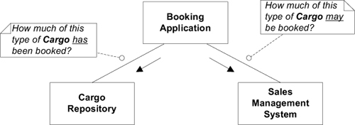

### 7.11.1 Connecting the Two Systems 连接两个系统

The Sales Management System was not written with the same model in mind that we are working with here. If the Booking Application interacts with it directly, our application will have to accommodate the other system’s design, which will make it harder to keep a clear MODEL-DRIVEN DESIGN and will confuse the UBIQUITOUS LANGUAGE. Instead, let’s create another class whose job it will be to translate between our model and the language of the Sales Management System. It will not be a general translation mechanism. It will expose just the features our application needs, and it will reabstract them in terms of our domain model. This class will act as an ANTICORRUPTION LAYER (discussed in Chapter 14).

> 销售管理系统（Sales Management System）并不是根据这里所使用的模型编写的。如果 Booking Application 与它直接交互，那么我们的应用程序就必须适应另一个系统的设计，这将很难保持一个清晰的 MODEL-DRIVEN DESIGN，而且会混淆 UBIQUITOUS LANGUAGE。相反，我们创建一个类，让它充当我们的模型和销售管理系统的语言之间的翻译。它并不是一种通用的翻译机制，而只是对我们的应用程序所需的特性进行翻译，并根据我们的领域模型重新对这些特性进行抽象。这个类将作为一个 ANTICORRUPTION LAYER（将在第 14 章讨论）。

This is an interface to the Sales Management System, so we might first think of calling it something like “Sales Management Interface.” But we would be missing an opportunity to use language to recast the problem along lines more useful to us. Instead, let’s define a SERVICE for each of the allocation functions we need to get from the other system. We’ll implement the SERVICES with a class whose name reflects its responsibility in our system: “Allocation Checker.”

> 这是连接销售管理系统的一个接口，因此首先就会想到将它叫做 Sales Management Interface（销售管理接口）。但这样一来就失去了用对我们更有价值的语言来重新描述问题的机会。相反，让我们为每个需要从其他系统获得的配额功能定义一个 SERVICE。我们用一个名为 Allocation Checker（配额检查器）的类来实现这些 SERVICE，这个类名反映了它在系统中的职责。

If some other integration is needed (for example, using the Sales Management System’s customer database instead of our own Customer REPOSITORY), another translator can be created with SERVICES fulfilling that responsibility. It might still be useful to have a lower level class like Sales Management System Interface to handle the machinery of talking to the other program, but it wouldn’t be responsible for translation. Also, it would be hidden behind the Allocation Checker, so it wouldn’t show up in the domain design.

> 如果还需要进行其他集成（例如，使用销售管理系统的客户数据库，而不是我们自己的 Customer REPOSITORY），则可以创建另一个翻译类来实现用于履行该职责的 SERVICE。用一个更低层的类（如 Sales Management System Interface）作为与其他程序进行对话的机制仍然是一种很有用的方法，但它并不负责翻译。此外，它将隐藏在 Allocation Checker 后面，因此领域设计中并不展示出来。

### 7.11.2 Enhancing the Model: Segmenting the Business 进一步完善模型：划分业务

Now that we have outlined the interaction of the two systems, what kind of interface are we going to supply that can answer the question “How much of this type of Cargo may be booked?” The tricky issue is to define what the “type” of a Cargo is, because our domain model does not categorize Cargoes yet. In the Sales Management System, Cargo types are just a set of category keywords, and we could conform our types to that list. We could pass in a collection of strings as an argument. But we would be passing up another opportunity: this time, to reabstract the domain of the other system. We need to enrich our domain model to accommodate the knowledge that there are categories of cargo. We should brainstorm with a domain expert to work out the new concept.

> 我们已经大致描述了两个系统的交互，那么提供什么样的接口才能回答“这种类型的货物可以接受多少预订”这个问题呢？问题的复杂之处在于定义 Cargo 的“类型”是什么，因为我们的领域模型尚未对 Cargo 进行分类。在销售管理系统中，Cargo 类型只是一组类别关键词，我们的类型只需与该列表一致即可。我们可以把一个字符串集合作为参数传入，但这样会错过另一个机会——重新抽象那个系统的领域。我们需要在领域模型中增加货物类别的知识，以便使模型更丰富；而且需要与领域专家一起进行头脑风暴活动，以便抽象出新的概念。

Sometimes (as will be discussed in Chapter 11) an analysis pattern can give us an idea for a modeling solution. The book Analysis Patterns (Fowler 1996) describes a pattern that addresses this kind of problem: the ENTERPRISE SEGMENT. An ENTERPRISE SEGMENT is a set of dimensions that define a way of breaking down a business. These dimensions could include all those mentioned already for the shipping business, as well as time dimensions, such as month to date. Using this concept in our model of allocation makes the model more expressive and simplifies the interfaces. A class called “Enterprise Segment” will appear in our domain model and design as an additional VALUE OBJECT, which will have to be derived for each Cargo.

> 有时，分析模式可以为建模方案提供思路（第 11 章将会讨论到）。《分析模式》[Fowler 1996]一书介绍了一种用于解决这类问题的模式：ENTERPRISE SEGMENT（企业部门单元）。ENTERPRISE SEGMENT 是一组维度，它们定义了一种对业务进行划分的方式。这些维度可能包括我们在运输业务中已经提到的所有划分方法，也包括时间维度，如月初至今（month todate）。在我们的配额模型中使用这个概念，可以增强模型的表达力，并简化接口。这样，我们的领域模型和设计中就增加了一个名为 Enterprise Segment 的类，它是一个 VALUE OBJECT，每个 Cargo 都必须获得一个 Enterprise Segment 类。

<Figures figure="7-10">The Allocation Checker acts as an ANTICORRUPTION LAYER presenting a selective interface to the Sales Management System in terms of our domain model.</Figures>
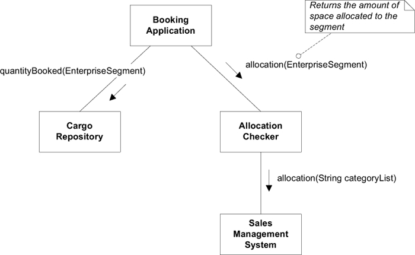

The Allocation Checker will translate between Enterprise Segments and the category names of the external system. The Cargo Repository must also provide a query based on the Enterprise Segment. In both cases, collaboration with the Enterprise Segment object can be used to perform the operations without breaching the Segment’s encapsulation and complicating their own implementations. (Notice that the Cargo Repository is answering a query with a count, rather than a collection of instances.)

> Allocation Checker 将充当 Enterprise Segment 与外部系统的类别名称之间的翻译。Cargo Repository 还必须提供一种基于 Enterprise Segment 的查询。在这两种情况下，我们可以利用与 Enterprise Segment 对象之间的协作来执行操作，而不会破坏 Segment 的封装，也不会导致它们自身实现的复杂化（注意，Cargo Repository 的查询结果是一个数字，而不是实例的集合）。

There are still a few problems with this design.

> 但这种设计还存在几个问题：

1. We have given the Booking Application the job of applying this rule: “A Cargo is accepted if the space allocated for its Enterprise Segment is greater than the quantity already booked plus the size of the new Cargo.” Enforcing a business rule is domain responsibility and shouldn’t be performed in the application layer.
2. It isn’t clear how the Booking Application derives the Enterprise Segment.

---

> 1. 我们给 Booking Application 分配了一个不该由它来执行的工作，那就是对如下规则的应用：“如果 Enterprise Segment 的配额大于已预订的数量与新 Cargo 数量的和，则接受该 Cargo。”执行业务规则是领域层的职责，而不应在应用层中执行。
> 2. 没有清楚地表明 Booking Application 是如何得出 Enterprise Segment 的。

Both of these responsibilities seem to belong to the Allocation Checker. Changing its interface can separate these two SERVICES and make the interaction clear and explicit.

> 这两个职责看起来都属于 Allocation Checker。通过修改接口就可以将这两个服务分离出来，这样交互就更整洁和明显了。

<Figures figure="7-11">Domain responsibilities shifted from Booking Application to Allocation Checker</Figures>
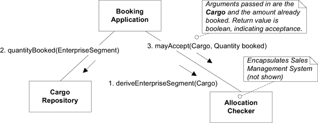

The only serious constraint imposed by this integration will be that the Sales Management System mustn’t use dimensions that the Allocation Checker can’t turn into Enterprise Segments. (Without applying the ENTERPRISE SEGMENT pattern, the same constraint would force the sales system to use only dimensions that can be used in a query to the Cargo Repository. This approach is feasible, but the sales system spills into other parts of the domain. In this design, the Cargo Repository need only be designed to handle Enterprise Segment, and changes in the sales system ripple only as far as the Allocation Checker, which was conceived as a FACADE in the first place.)

> 这种集成只有一条严格的约束，那就是有些维度是不能被 Sales Management System 使用的，具体来说就是那些无法用 Allocation Checker 转换为 Enterprise Segment 的维度（在不使用 ENTERPRISE SEGMENT 的情况下，这条约束的作用是使销售系统只能使用那些可以在 Cargo Repository 查询中使用的维度。虽然这种方法也行得通，但销售系统将会溢出而进入领域的其他部分中。在我们这个设计中，Cargo Repository 只需处理 Enterprise Segment，而且销售系统中的更改只影响到 Allocation Checker，而 Allocation Checker 可以被看作是一个 FACADE）。

### 7.11.3 Performance Tuning 性能优化

Although the Allocation Checker’s interface is the only part that concerns the rest of the domain design, its internal implementation can present opportunities to solve performance problems, if they arise. For example, if the Sales Management System is running on another server, perhaps at another location, the communications overhead could be significant, and there are two message exchanges for each allocation check. There is no alternative to the second message, which invokes the Sales Management System to answer the basic question of whether a certain cargo should be accepted. But the first message, which derives the Enterprise Segment for a cargo, is based on relatively static data and behavior compared to the allocation decisions themselves. One design option would be to cache this information so that it could be relocated on the server with the Allocation Checker, reducing messaging overhead by half. There is a price for this flexibility. The design is more complicated and the duplicated data must now be kept up to date somehow. But when performance is critical in a distributed system, flexible deployment can be an important design goal.

> 虽然与领域设计的其他方面有利害关系的只是 Allocation Checker 的接口，但当出现性能问题时，Allocation Checker 的内部实现可能为解决这些问题提供机会。例如，如果 Sales Management System 运行在另一台服务器上（或许在另一个位置上），那么通信开销可能会很大，而且每个配额检查都需要进行两次消息交换。第二条消息需要调用 Sales Management System 来回答是否应该接受货物，因此并没有其他的替代方法可用来处理这条消息。但第一条消息是得出货物的 Enterprise Segment，这条消息所基于的数据和行为与配额决策本身相比是静态的。这样，一种设计选择就是缓存这些信息，以便 Allocation Checker 在需要的时候能够在自己的服务器上找到它们，从而将消息传递的开销降低一半。但这种灵活性也是有代价的。设计会更复杂，而且被缓存的数据必须保持最新。但如果性能在分布式系统中是至关重要的因素的话，这种灵活部署可能成为一个重要的设计目标。

## 7.12 A FINAL LOOK 小结

That’s it. This integration could have turned our simple, conceptually consistent design into a tangled mess, but now, using an ANTICORRUPTION LAYER, a SERVICE, and some ENTERPRISE SEGMENTS, we have integrated the functionality of the Sales Management System into our booking system cleanly, enriching the domain.

> 情况就是这样了。这种集成原本可能把我们这个简单且在概念上一致的设计弄得乱七八糟，但现在，在使用了 ANTICORRUPTION LAYER、SERVICE 和 ENTERPRISE SEGMENT 之后，我们已经干净利落地把 Sales Management System 的功能集成到我们的预订系统中了，从而使领域更加丰富。

A final design question: Why not give Cargo the responsibility of deriving the Enterprise Segment? At first glance it seems elegant, if all the data the derivation is based on is in the Cargo, to make it a derived attribute of Cargo. Unfortunately, it is not that simple. Enterprise Segments are defined arbitrarily to divide along lines useful for business strategy. The same ENTITIES could be segmented differently for different purposes. We are deriving the segment for a particular Cargo for booking allocation purposes, but it could have a completely different Enterprise Segment for tax accounting purposes. Even the allocation Enterprise Segment could change if the Sales Management System is reconfigured because of a new sales strategy. So the Cargo would have to know about the Allocation Checker, which is well outside its conceptual responsibility, and it would be laden with methods for deriving specific types of Enterprise Segment. Therefore, the responsibility for deriving this value lies properly with the object that knows the rules for segmentation, rather than the object that has the data to which those rules apply. Those rules could be split out into a separate “Strategy” object, which could be passed to a Cargo to allow it to derive an Enterprise Segment. That solution seems to go beyond the requirements we have here, but it would be an option for a later design and shouldn’t be a very disruptive change.

> 还有最后一个设计问题：为什么不把获取 Enterprise Segment 的职责交给 Cargo 呢？如果 Enterprise Segment 的所有数据都是从 Cargo 中获取的，那么乍看上去把它变成 Cargo 的一个派生属性是一种不错的选择。遗憾的是，事情并不是这么简单。为了用有利于业务策略的维度进行划分，我们需要任意定义 Enterprise Segment。出于不同的目的，可能需要对相同的 ENTITY 进行不同的划分。出于预订配额的目的，我们需要根据特定的 Cargo 进行划分；但如果是出于税务会计的目的时，可能会采取一种完全不同的 Enterprise Segment 划分方式。甚至当执行新的销售策略而对 Sales Management System 进行重新配置时，配额的 Enterprise Segment 划分也可能会发生变化。如此，Cargo 就必须了解 Allocation Checker，而这完全不在其概念职责范围之内。而且得出特定类型 Enterprise Segment 所需使用的方法会加重 Cargo 的负担。因此，正确的做法是让那些知道划分规则的对象来承担获取这个值的职责，而不是把这个职责施加给包含具体数据（那些规则就作用于这些数据上）的对象。另一方面，这些规则可以被分离到一个独立的 Strategy 对象中，然后将这个对象传递给 Cargo，以便它能够得出一个 Enterprise Segment。这种解决方案似乎超出了这里的需求，但它可能是之后设计的一个选择，而且应该不会对设计造成很大的破坏。
